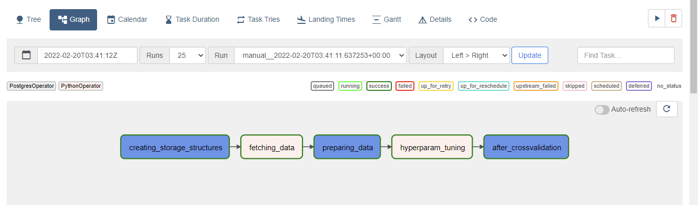
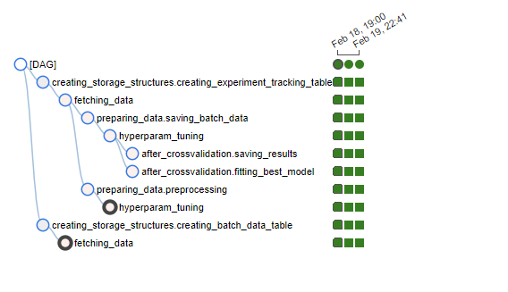
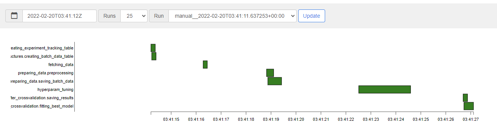

**Machine Learning Operations for CRONUS [Corporate Reputation Online News Understanding System**

This project makes use of Apache AirFlow to automate and schedule the model training and deployment of Digital Innovation's
Corporate Reputation Analysis. 

_Apache Airflow is an open-source workflow management platform for data engineering pipelines. It started at Airbnb in 
October 2014 as a solution to manage the company's increasingly complex_

Additionally, coupled with a flask based web application, this project will allow the Sumitovant Communications Team to 
explore and provide feedback on the insights provided by CRONUS through a series of perfectly custom visualizations.

AirFlow is deployed in a docker container with the following services defined in the docker-compose.yaml file

    postgres (makes use of coupled postgres volume, will need to be chaged to spark or similar)
    airflow-webserver (handy tool to view and explore DAGs)
    airflow-scheduler
    airflow-triggerer 
    airflow-init
    airflow-cli 

Machine Learning Pipelines are defined as DAGs (Directed Acyclic Graphs) which are written in python. Please see
ml_pipeline.py in the dags directory to inspect the example pipeline. Individual tasks are in the dags/utils/ directory
and PGSQL scripts are in dags/sql/ directory. 

the airflow-webserver service provides a clean way to inspect DAGs and their deployments.

**DAG Graph**

**DAG Tree**

**DAG Gantt**

Luigi was also considered as a task orchestration tool but given it's focus on file based tasks AirFlow was chosen.

